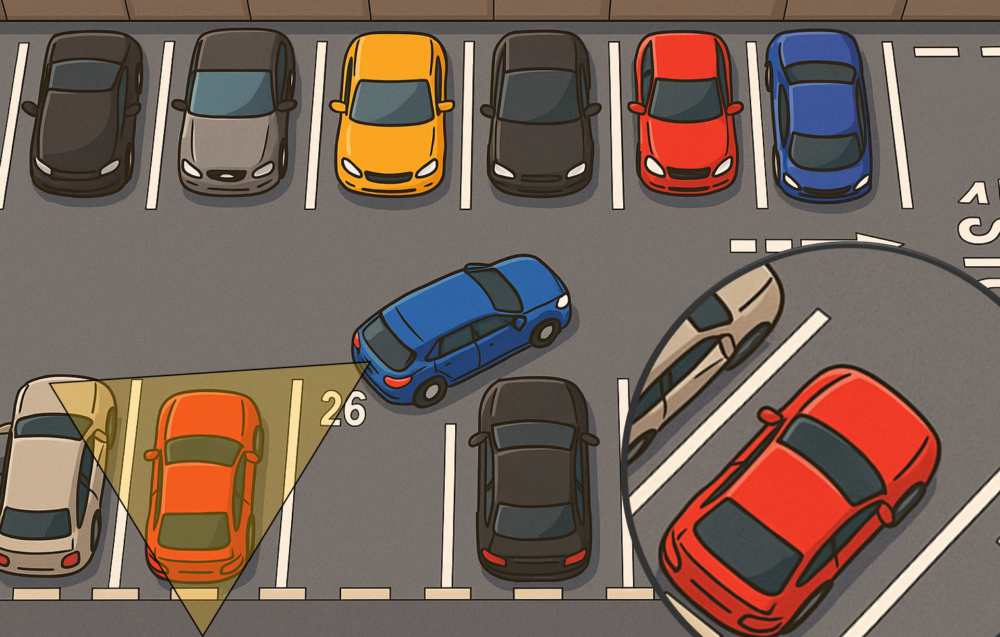
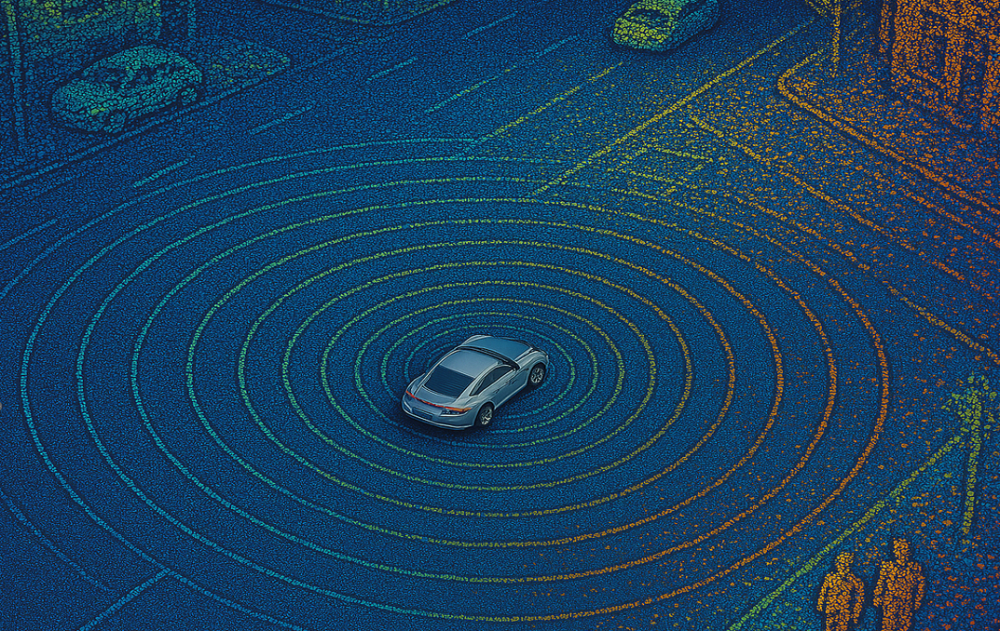
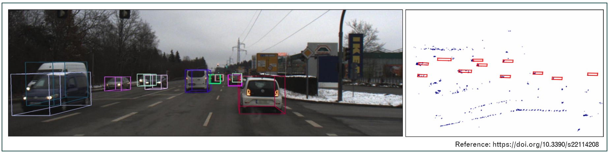
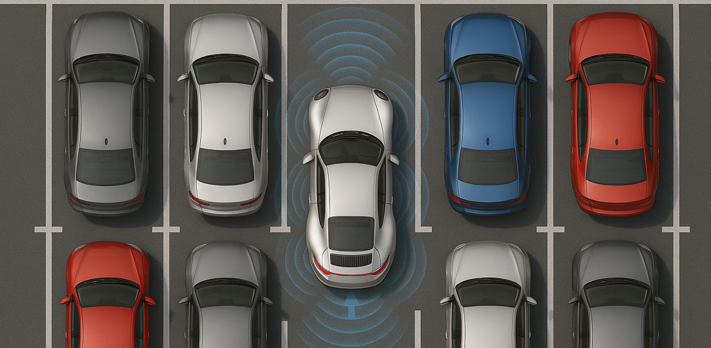
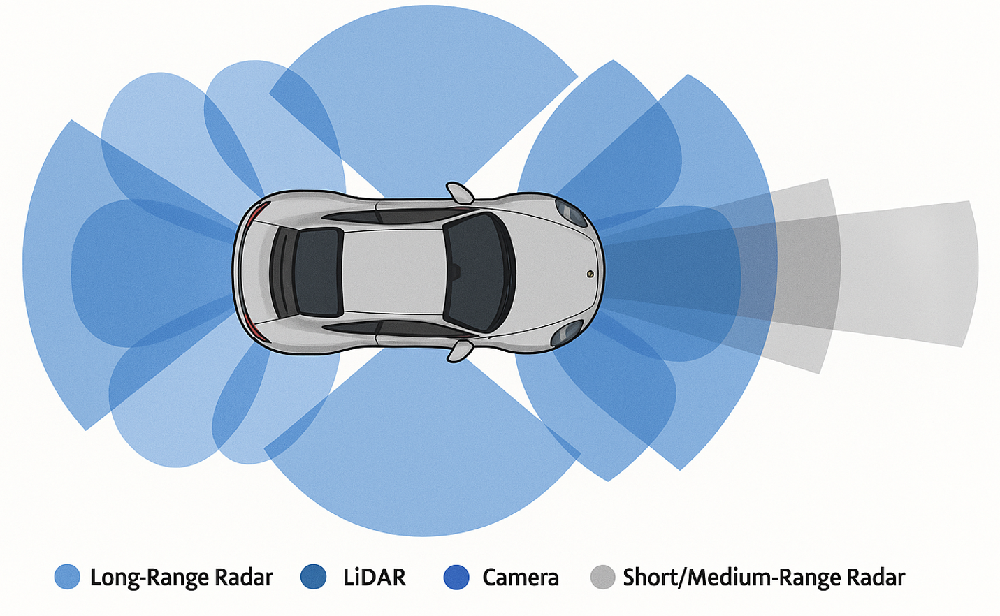

# Perception-Sensors

Automotive perception sensors are integral components in modern vehicles, especially in systems such as Advanced Driver Assistance Systems (ADAS) and autonomous driving platforms. These sensors enable a vehicle to perceive and understand its environment, similar to how human senses work. Below is a comprehensive overview of the various types of automotive perception sensors, along with visual aids to illustrate their functions and characteristics.

---

## 1. Camera Sensors

### Overview
Camera sensors capture visual information from the environment. They are widely used for object detection, lane detection, traffic sign recognition, and more.

### Types
- **Monocular Cameras**: Single lens; used for object classification.
- **Stereo Cameras**: Dual lenses; provide depth information.
- **Surround-view Cameras**: Multiple cameras stitched together for a 360° view.
- **Infrared/Night Vision Cameras**: Enhance visibility in low-light conditions.

### Strengths
- High resolution imagery.
- Great for object classification and visual cues.

### Limitations
- Affected by lighting conditions (e.g., glare, low light).
- Sensitive to weather (e.g., rain, fog).

  

---

## 2. LiDAR (Light Detection and Ranging)

### Overview
LiDAR sensors measure distances by emitting laser pulses and calculating the time it takes for the light to reflect back. They provide a precise 3D map of the environment.

### Strengths
- High spatial resolution.
- Accurate depth perception.
- Excellent for 3D mapping.

### Limitations
- Expensive compared to other sensors.
- Performance degrades in adverse weather (fog, rain).

  

---

## 3. RADAR (Radio Detection and Ranging)

### Overview
RADAR systems use radio waves to detect the position and speed of objects. Commonly used for adaptive cruise control and collision avoidance.

### Strengths
- Works well in bad weather and low visibility.
- Long-range detection.
- Measures speed via Doppler effect.

### Limitations
- Lower resolution than LiDAR and cameras.
- Struggles with detailed object classification.

  

---

## 4. Ultrasonic Sensors

### Overview
Ultrasonic sensors emit high-frequency sound waves and measure their reflections. Mainly used for close-range detection like parking assist.

### Strengths
- Affordable and reliable for short distances.
- Compact and easy to integrate.

### Limitations
- Limited range (a few meters).
- Low resolution.

  

---

## 5. IMU (Inertial Measurement Unit)

### Overview
IMUs contain accelerometers and gyroscopes that measure a vehicle's linear acceleration and rotational rates.

### Strengths
- High update rate.
- Useful for dead reckoning and short-term localization.

### Limitations
- Prone to drift over time.
- Requires fusion with other sensors.

---

## 6. GPS (Global Positioning System)

### Overview
GPS provides global localization by communicating with satellites. Essential for route planning and geolocation.

### Strengths
- Global coverage.
- Works well in open environments.

### Limitations
- Reduced accuracy in urban areas or tunnels.
- Susceptible to signal loss.

---

## Sensor Fusion

### Concept
Sensor fusion involves combining data from multiple sensors to produce a more accurate and robust understanding of the vehicle's surroundings. Each sensor has its own strengths and weaknesses, and fusion compensates for these individual limitations.

### Example
- Combine camera and LiDAR for object classification and depth estimation.
- Use GPS and IMU together for more reliable localization.

  

---

## Conclusion
Automotive perception sensors form the backbone of intelligent driving systems. By integrating data from multiple types of sensors, vehicles can achieve higher levels of autonomy and safety.

| Sensor       | Strengths                         | Limitations                       | Common Use Cases                |
|--------------|------------------------------------|-----------------------------------|---------------------------------|
| Camera       | High resolution, object detection | Sensitive to lighting/weather     | Lane keeping, traffic signs     |
| LiDAR        | Accurate 3D mapping               | Cost, weather sensitivity         | Obstacle avoidance, localization|
| RADAR        | Long range, speed detection       | Low resolution                    | Cruise control, collision alert |
| Ultrasonic   | Affordable, short-range           | Very limited range                | Parking assistance              |
| IMU          | Fast, no external dependency      | Drift without correction          | Motion tracking                 |
| GPS          | Global coverage                   | Signal loss, reduced accuracy     | Navigation                      |

---

